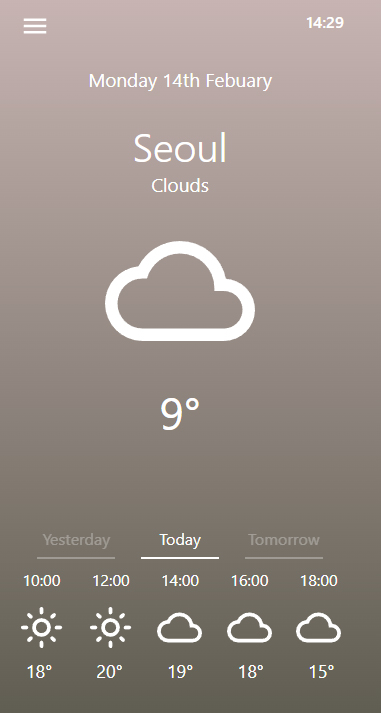
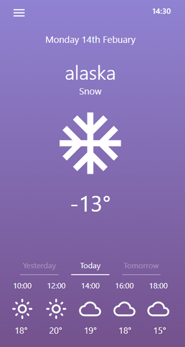
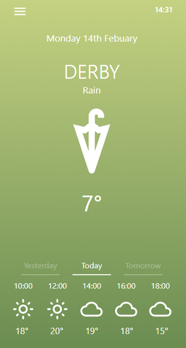

# <a href="https://Gyu-Yeon.github.io">Weather App 1.0.0</a>  <<< Click to Check The World city's Weather!!!

</a>
  
## 기본 정보 
- React.js를 활용하여 제작한 세계 도시 날씨 어플입니다.

## 사용 예제

     
- 각 국의 도시 날씨를 확인하고 싶을 때 이 웹앱을 활용하여 손쉽게 찾아볼 수 있습니다.

 
 1. 왼쪽 상단 햄버거 메뉴를 클릭하여 도시이름을 검색할 수 있는 페이지로 이동.
 2. 영어로 도시이름을 검색 후 , Change 버튼을 누르면 해당 도시의 날씨를 확인할 수 있습니다.
 3.  발행한 글의 오른쪽 문서 이모티콘 클릭시 글 수정 페이지로 이동하여 글 수정 가능.

## 업데이트 내역

* 1.0.0
    * 배포: Github를 통해 React 프로젝트 배포.
